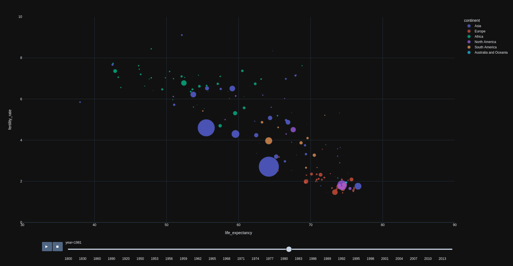

# Visualizations
This repo is supposed to demonstrate various visualizatioins such as graphs and dashboards

* The folder `data` contains all required data for the visualizations
 
* By executing `plotly_life_ex-vs-fert_rate_code.py` an interactive html file is generated which shows the fertility rate and the life expectancy per country
 on the y- and x-axes. A scrallbar guides you through the years between 1800 and 2015 and demonstrates the changing relationship between fertility and 
 life expectancy. Furthermore the pointsize of the scatterplot, corresponding to a country indicates the size of the population, 
 whereas the colorcode clusters the continents.
 
 * `plotly_life_ex-vs-fert_rate.png` shows a snapshot of the interactive graph generated with `plotly_life_ex-vs-fert_rate_code.py`
 
 

